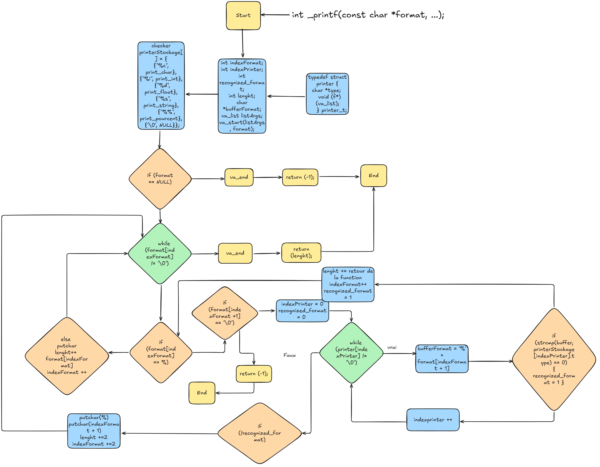

# holbertonschool-printf

A custom implementation of the C `printf` function, written as part of the Holberton curriculum.



## Description

The project aims to recreate the standard `printf` function.  
The `_printf` function prints formatted text by interpreting various *format specifiers*.

## Objectives

The main objectives of this project are:

- Understand how variadic functions work in C using `stdarg.h`
- Reproduce the behavior of the standard `printf` function
- Implement a modular and scalable format-handling system
- Improve knowledge of function pointers and structured code organization
- Follow strict coding style and compilation constraints

## Requirements

To compile, run, and maintain this project, the following requirements must be met:

- **GCC Compilation**
  The project must be compiled with the `gcc` compiler using the following flags:  
  `-Wall -Werror -Wextra -pedantic -std=gnu89`

- **Betty Coding Style**
  All code must strictly follow the **Betty style guidelines**, including:
  - Betty-style formatting  
  - Betty-style documentation  
  - Proper function and file organization

- **Allowed Files**
  Only the required project files should be present. No extra files should be added without justification.

- **No Global Variables**
  The use of global variables is strictly prohibited.

- **Code Organization**
  - Maximum of 5 functions per file (as per Holberton requirements)  
  - All header files must include proper *include guards*  
  - Code must remain clean, readable, and well-structured

- **Minimum Required Features**
  At minimum, the implementation must support the following format specifiers: `%c`, `%s`, `%d`, `%i`, `%%`

- **Recommended Environment**
  - Linux-based OS or WSL  
  - Text editor or IDE of your choice (Vim, VSCode, etc.)

## Prototype

```c
int _printf(const char *format, ...);
```

## Supported Specifiers

| Specifier | Description |
|-----------|-------------|
| `%c` | Prints a character |
| `%s` | Prints a string |
| `%d`, `%i` | Prints a signed integer |
| `%%` | Prints the `%` symbol |

## Example Usage

```c
#include "main.h"

int main(void)
{
    _printf("Hello, world!\n");
    _printf("Number: %d, String: %s, Char: %c, Percent: %%\n", 42, "Test", 'A');
    return (0);
}

```

## Output :

```c
Hello, world!
Number: 42, String: Test, Char: A, Percent: %
```

## Man Page

A manual page (`man_3_printf`) is included with the project to provide detailed documentation about the `_printf` function.

### How to View the Man Page

After generating or copying the `man_3_printf` file into your system, you can display it using:

```bash
man ./man_3_printf
```

## Add permission to use Betty and Valgrind

```bash
chmod u+x _printf.c
```

## Betty Style 

```bash
betty _printf.c
```

## Valgrind

```bash
valgrind --leak-check=full _printf.c
```

## Compilation

```bash
gcc -Wall -Werror -Wextra -pedantic -std=gnu89 *.c -o printf
```

## Project Structure

- `main.h` — Prototypes and includes  
- `_printf.c` — Main function implementation  
- `fonctions.c` — File withe all functions 
- `man_3_printf` — Manual page 

## Constraints

- No global variables  
- Must use the required GCC flags  
- Must follow the required coding style  

## Author

LenyBl and ZimEthane

## License

This project may be freely used and modified.
